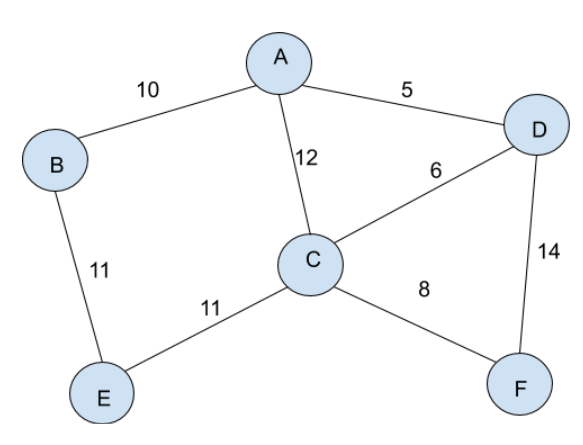

There are two major pathfinding algorithms that are needed at A-Level. They are able to be applied to a graph, and seek to find the optimum route from one vertex in the graph to another.

Such pathfinding algorithms, are of course used when finding routes  through the real world, as a sat-nav might do. Similarly, a pathfinding algorithm is employed to find the optimum route through the internet for sent packets.

## Dijkstra's Algorithm
Time: O($n^2$), Space: O($n$)

This algorithm is fundamentally similar to the breadth-first traversal of a graph, and as such is known as a greedy algorithm. It is important to note that Dijkstra's algorithm on its own cannot find the shortest path. To do this, simply keep an array of the steps taken to each vertex. When the distance to that vertex is updated, update the array with that route as well.

### Steps:

1. Initialise a list of known distances from the visited part of the graph.

    > The array should be of length equal to the number of vertices. All values should be initialised to infinity, except for the value corresponding to the starting node.    

2. Visit the vertex in the array the smallest distance from the starting vertex not already visited.

3. Update the array with all the distances of neighbours from starting vertex. If the distance computed from this vertex is smaller than the known distance, overwrite it.

4. Repeat steps 2 and 3 until the destination vertex has been visited. The cost to get here is the minimum cost, and the route is the most efficient.

### An Example

Here is our graph, we will be going from A to F:

#### 1. Create Table
Choose closest node to start (A)

| Node | Distance | Visited | Route |
| ---- | -------- | ------- | ----- |
| A    | 0        | ❌      | none  |
| B    | inf      | ❌      |       |
| C    | inf      | ❌      |       |
| D    | inf      | ❌      |       |
| E    | inf      | ❌      |       |
| F    | inf      | ❌      |       | 
Currently at: Nowhere

#### 2. Visit A and update distances from start.
Choose closest unvisited node to start (D)

| Node | Distance | Visited | Route |
| ---- | -------- | ------- | ----- |
| A    | 0        | ✔️      | none  |
| B    | 10       | ❌      | A->B  |
| C    | 12       | ❌      | A->C  |
| D    | 5        | ❌      | A->D  | 
| E    | inf      | ❌      |       |
| F    | inf      | ❌      |       |
Currently at: A

#### 3. Visit D and update distances from start.
Choose closest unvisited node to start (B)

| Node | Distance | Visited | Route   |
| ---- | -------- | ------- | ------- |
| A    | 0        | ✔️      | none    |
| B    | 10       | ❌      | A->B    |
| C    | 11       | ❌      | A->C    |
| D    | 5        | ✔️      | A->D    |
| E    | inf      | ❌      |         |
| F    | 19       | ❌      | A->D->F | 
Currently at: D

#### 4. Visit B and update distances from start.
Choose closest unvisited node to start (C)

| Node | Distance | Visited | Route   |
| ---- | -------- | ------- | ------- |
| A    | 0        | ✔️      | none    |
| B    | 10       | ✔️      | A->B    |
| C    | 11       | ❌      | A->C    |
| D    | 5        | ✔️      | A->D    |
| E    | 21       | ❌      | A->B->E | 
| F    | 19       | ❌      | A->D->F        |
Currently at: B

#### 5. Visit C and update distances from start.
Choose closest unvisited node to start (F)

| Node | Distance | Visited | Route   |
| ---- | -------- | ------- | ------- |
| A    | 0        | ✔️      | none    |
| B    | 10       | ✔️      | A->B    |
| C    | 11       | ✔️      | A->D->C |
| D    | 5        | ✔️      | A->D    |
| E    | 21       | ❌      | A->B->E |
| F    | 19       | ❌      | A->D->F | 
Currently at: C

#### 6. Visit F and update distances from start.
Choose closest unvisited node to start (B)

| Node | Distance | Visited | Route   |
| ---- | -------- | ------- | ------- |
| A    | 0        | ✔️      | none    |
| B    | 10       | ✔️      | A->B    |
| C    | 11       | ✔️      | A->D->C |
| D    | 5        | ✔️      | A->D    |
| E    | 21       | ❌      | A->B->E |
| F    | 19       | ✔️      | A->D->F | 
Currently at: F

#### 7. Visit E and update distances from start.

| Node | Distance | Visited | Route   |
| ---- | -------- | ------- | ------- |
| A    | 0        | ✔️      | none    |
| B    | 10       | ✔️      | A->B    |
| C    | 11       | ✔️      | A->D->C |
| D    | 5        | ✔️      | A->D    |
| E    | 21       | ✔️      | A->B->E |
| F    | 19       | ✔️      | A->D->F | 
Currently at: E

#### 8. All Distances have been computed
Return the distance (and maybe path) to the desired node.

## A*
Time: O($b^d$), Space: O($b^d$)

Unlike Dijkstra, the A* algorithm does not need to visit every vertex in the graph, thus cutting down on the precomputation time. Again unlike Dijkstra, A* is not guaranteed to always provide the theoretically most optimal solution. If the heuristics provided are poor, then the algorithm will blunder all the time.

### An Algorithm

The algorithm for A* is a modification of the [Dijkstra's pathfinding algorithm](Pathfinding#Steps), where instead of taking into account just the distance, the sum of the distance and the heuristic of a value is used. It is important to note that when the final distance is being reported, only the sums of the distances are returned, not the distances plus the heuristics. 

### Example
Here is our graph, we will be starting at A, and going to F:
![[Graph-with-heuristics.png]]

#### 1. Create Table
Choose to move to A, it is the closest via total score.

| Node | Distance | Heuristic | Total Score | Visited | Previous |
| ---- | -------- | --------- | ----------- | ------- | -------- |
| A    | 0        | 10        | 10          | ❌      | none     |
| B    | inf      | 15        |             | ❌      |          |
| C    | inf      | 5         |             | ❌      |          |
| D    | inf      | 5         |             | ❌      |          |
| E    | inf      | 10        |             | ❌      |          |
| F    | inf      | 0         |             | ❌      |          |
Currently At: Nowhere

#### 2. Visit A and update distances from starting node
Choose to move to D, it is the next closest unvisited node via total score.

| Node | Distance | Heuristic | Total Score | Visited | Previous |
| ---- | -------- | --------- | ----------- | ------- | -------- |
| A    | 0        | 10        | 10          | ✔️      | none     |
| B    | 10       | 15        | 25          | ❌      |          |
| C    | 12       | 5         | 17          | ❌      |          |
| D    | 5        | 5         | 10          | ❌      |          |
| E    | inf      | 10        |             | ❌      |          |
| F    | inf      | 0         |             | ❌      |          |
Currently At: A

#### 3. Visit C and update distances from starting node
Choose to move to C, it is the closest unvisited node via total score.

| Node | Distance | Heuristic | Total Score | Visited | Previous |
| ---- | -------- | --------- | ----------- | ------- | -------- |
| A    | 0        | 10        | 10          | ✔️      | none     |
| B    | 10       | 15        | 25          | ❌      |          |
| C    | 12       | 5         | 17          | ❌      |          |
| D    | 5        | 5         | 10          | ✔️      | A        |
| E    | inf      | 10        |             | ❌      |          |
| F    | 19       | 0         | 19          | ❌      |          |
Currently At: D

#### 4. Visit F and update distances from starting node
Choose to move to F, it is the closest unvisited node via total score.

| Node | Distance | Heuristic | Total Score | Visited | Previous |
| ---- | -------- | --------- | ----------- | ------- | -------- |
| A    | 0        | 10        | 10          | ✔️      | none     |
| B    | 10       | 15        | 25          | ❌      |          |
| C    | 12       | 5         | 17          | ✔️      | A        |
| D    | 5        | 5         | 10          | ✔️      | A        |
| E    | 23       | 10        | 33          | ❌      |          |
| F    | 19       | 0         | 19          | ❌      |          |
Currently At: C

#### 5. Currently at destination node
Stop traversing the graph, begin to trace back steps.

| Node | Distance | Heuristic | Total Score | Visited | Previous |
| ---- | -------- | --------- | ----------- | ------- | -------- |
| A    | 0        | 10        | 10          | ✔️      | none     |
| B    | 10       | 15        | 25          | ❌      |          |
| C    | 12       | 5         | 17          | ✔️      | A        |
| D    | 5        | 5         | 10          | ✔️      | A        |
| E    | 23       | 10        | 33          | ❌      |          |
| F    | 19       | 0         | 19          | ❌      | C        | 
Currently At: F

#### 6. Trace back steps
The destination node's previous node was C.
C's previous node was A.
A's previous node was none. It was therefore the starting node.
The route taken was A $\rightarrow$ C $\rightarrow$ F.