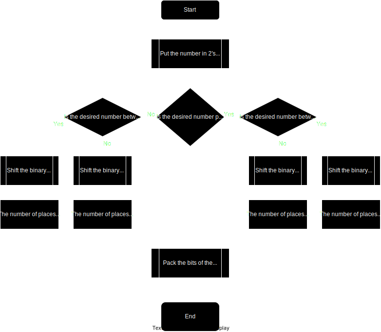

## Why do computers use binary representations?
Computers are made from hardware, such as logic gates and transistors through which electric current can either flow or not flow. This directly translates to the on/off states or 1/0 in a binary number.

## How are other pieces of data represented?
All other pieces of data must be assigned a unique number. Thus schemas for mapping between a number and a set of other data (such as ASCII or Unicode) must be created.

## Subtracting numbers
To subtract numbers, there are two methods
1. Sign + Magnitude
	The most significant bit of a number is given the role of being the sign bit. If it is zero, the number is positive, else: the number is negative. The rest of the number is used to define the magnitude. This cannot be used to do subtraction, however, this may be used to store numbers.
2. 2's Compliment  
	Consider the equation: $a - b = c$, where `typeof a = uint32` and `typeof b = uint32`
	1. Take the two's compliment of $b$, resulting in $b'$  
	2. Add one to $b'$ to get $\bar{b}$
		- eg. 	80 = 0b01010000, -80 = 0b10110000
		- eg. 	59 = 0b00111101, -59 = 0b11000011
	3. Add $a$ and $\bar{b}$ to get $c$
		- eg.  $75 - 36 = 39$ -> `0b01001011` + `0b11011100` = `0b00100111`
		- eg. $95 - 56 = 39$ -> `0b01011111` + `0b11001000` = `0b00100111` 

## Numbers with a fractional component
### Fixed Point
This works largely the same as integers, except that some of the binary digits represent fractional components. In fact, you can even perform subtraction the same way as with integers (ie. using the 2's compliment). In low power devices, the processor may not have floating point acceleration, and so fixed point numbers are used. To enable fixed point numbers, use the compiler flag `--nofpu`. There are two main problems with using fixed point numbers:
1. It is not clear where the '*decimal point*' is placed. This requires more memory to store, and comes with the problem of poor standardisation.
2. To gain accuracy, many digits are needed. For this reason, it is inadvisable to use fixed point numbers of length less than 32 bits. Unlike floating point, there is perfect accuracy representing integers, however, there is very little accuracy representing extremely small numbers, or numbers which do not neatly fall into the sum of a set of powers of two.
### Floating Point
This type of number comes in two types, single and double precision (both of which are defined in IEEE 754). Single precision uses 32 bits, and double precision uses 64 bits. Floating point numbers are largely based on scientific notation, except in base two rather than base ten.

The format of IEEE 754 Single Precision Floating Point Numbers are as follows:  
SEEEEEEEEMMMMMMMMMMMMMMMMMMMMMMM  
Where: 
- S is the sign bit;
- EEEEEEEE is the exponent (8 bits);
- MMMMMMMMMMMMMMMMMMMMMMM is the mantissa (23 bits);

In effect, the exponent is equal to the number $n$ in the form $a*2^n$, and the mantissa is equal to the number $a$. This differs from base 10 scientific notation, where the number $n$ is exponentiating 10 instead of two.

### Decimal for exams.
In exams, decimal numbers may be given in eight bits. This uses an entirely arbritary and completely ***NON-STANDARD*** method for representing a decimal. The only advantage of this, is that addition and subtraction work in the same way as for integers. The format is as follows:

MMMMMEEE  
Where: 
- MMMMM is the mantissa (5 bits);
- and EEE is the exponent (3 bits);

To convert between the format and denary numbers follow the following steps.

### Addition and subtraction of OCR Decimal
1. Undo the normalisation step
2. Make the exponents the same (also pad the mantissa to correct for this)

> An example:
> 5 + 1.375 > 01010 011 + 01011 001
>
>   0101.000
> + 0001.011
> = 0110.011 = 6.375
>
> 0110011 011 > 0110011011

## Binary Coded Decimal
Write the number in denary, except replace each digit with the nibble that represents that number.  
eg.  
  1    2    3			123  
0001 0010 0011 -> 000100100011  