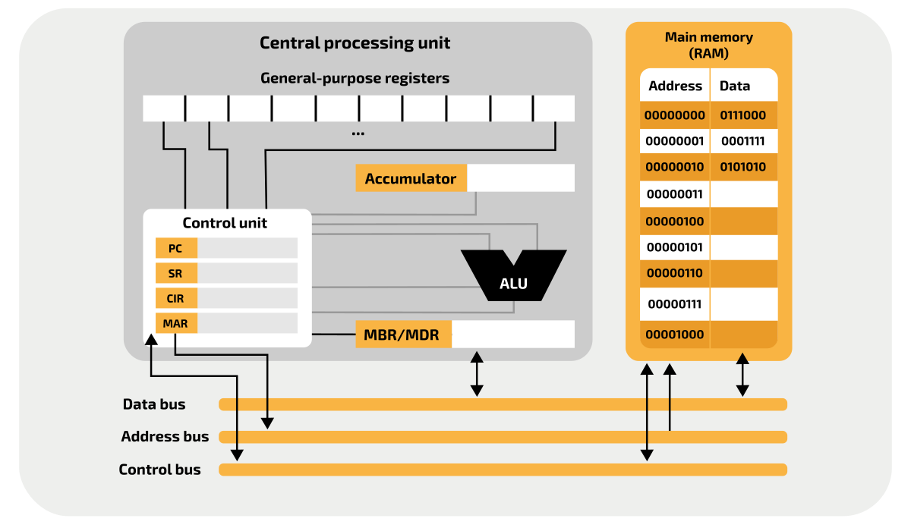

Every time the processor carries out an instruction, it goes through the fetch/decode/execute cycle (sometimes called the instruction cycle). 

Before the FDE cycle can take place, a program's instructions must already have been compiled to appropriate machine code, and loaded into RAM.

At the end of each cycle, the processor checks the ***status register*** for errors, exceptions, or interrupts that need handling. If an interrupt is found, execution may be moved to the ISR or interrupt service routine.

## Fetch
1. The ***Program Counter*** (PC) keeps the address of the next instruction to be executed. The contents of the PC are copied to the ***Memory Address Register*** (MAR), which is connected to the ***Address Bus***. Thus, the address of the next instruction to be executed is placed on the address bus.

2. Once the address of the instruction is on the address bus, the control unit instructs a **memory read** operation to allow the contents of the memory location to be transferred to the processor. The instruction that is stored at that address is transferred using the ***data bus*** from the main memory to the processor, and is saved in the ***Memory Data Register*** (MDR).
Simultaneously, the contents of the PC are incremented, such that they hold the address of the next instruction to be executed. This only applies ofr completely sequential programs, where branch instructions may directly modify the PC to jump to the relevant section of code.  

3. The contents of the MDR are copied to the ***Current Instruction Register*** (CIR). This ensures that the current instruction is kept safe so that the MDR can be used during the execute stage, in order to store additional data as needed.

## Decode
1. The control unit decodes the instruction that is kept in the CIR. This involves splitting the instruction into operand and opcode to determine what type of instruction needs to be carried out, checking if additional data is required from memory, and figuring out where it is kept in main memory.

## Execute
1. The instruction is executed. The exact sequence of operations depends on the type of instruction that is being executed. For example, for an arithmetic operation, any required data is fetched from the main memory (or general purpose registers), then the calculation is executed by the ***Arithmetic Logic unit*** (ALU), and the result of the instruction is stored in the ***Accumulator*** (ACC), a general purpose register, or back into main memory.

In case the program requires a non-sequential instruction to be executed, for example if the current instruction is a branch at this stage, the address of the next instruction to be executed is determined and loaded to the PC.

## Clock cycles per operation
In the model of a computer, a data transfer is generally described as one operation. In reality, it can take many clock cycles to achieve a data transfer from one component to another.
- If the processor needs to read a memory location, it sends a read request via the control bus, along with the address of the memory location via the address bus. The operation happen at the same time (i.e. in the same clock cycle).
- Depending on how long it takes to access the memory, the processor then receives the contents of that memory location via the data bus, after a number of clock cycles.
- If the processor needs to write to a memory location, it sends a write request via the control bus, along with the address of that memory location via the address bus and the data that needs to be stored via the data bus.

## Pipelines
In modern processors, a basic level of concurrency is used via the use of pipelining. This involves running multiple instructions at the same time by offsetting their positions in the FDER cycle. For example: 

