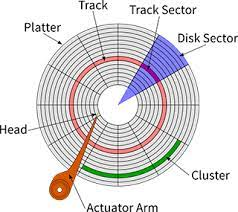

There are several ways of storing the file systems, some of the most common are NTFS (for windows), FAT (older windows), EXT4 (Most Linux Distros), and APFS (apple). The easiest to understand is FAT, or the File Allocation Table.

## The FATx format
The size of a FAT in bits (32 or 16 are common) determines how large any given file, drive, partition may be, as each sector or otherwise is assigned a unique number.

The file allocation table, usually kept in the early sectors of the disk, contain the file names, locations on the drive physically, and various pieces of metadata about each file and folder.

These pieces of metadata may include:
- File Name
- File Permissions
- Creation / Modification data
- Start sector / nodal point
    - Files are generally split across the drive, as such, the individual blocks of the file must be kept track of in a linked list.
- The size of the file.
- The file paths.
    - There is no such thing as a directory structure on the drive physically, and none in the FAT. All of this is an abstraction provided for the benefit of the user.

Most file systems were designed to be used on physical, moving media, and not SSDs or other flash storage. As such, a special controller is needed to convert from the hard-drive centric instructions to those more apt for a given NAND package.

## Spinning Media
This applies to:
- HDDs
- Floppy Disks
- DVD-RAM
- DVD-R
- CD-R

The structure of a given drive, is made of various platters, or disks, which are usually stacked on top of each other. These are read by a read-head, which may be magnetic or optical which allows for reading of the disk.
Each platter is made of tracks and sectors. 
* A track is an area of the the drive that is in the shape of a concentric ring. There are many tracks on a drive, each of different (sometimes the same) sizes. 
* A Sector is an area of the drive, that is largely arc shaped. However, this only applies on a single track drive, as each sector only lasts within a given track.

