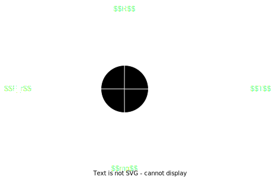

### The Forces

$F_{R} \propto R$  
$F_{R} \leq \mu R$  

Where $\mu$ is the *coefficient of friction*, which is in effect a measure of roughness (0 = very smooth, 1 = very rough) and $R$ is the normal reaction force.

$F_{Rmax} = \mu R$

As $T$ increases, to pull the particle along, $F_R$ will increase to oppose this, resulting in no net movement. Eventually, the frictional force will hit a maximum ($F_{Rmax}$). At this point, where friction is at a maximum, but the particle is yet to move ($T = F_{Rmax}$), the situation is known as limiting equilibrium. After this, the tension grows large enough to overcome the maximum  frictional force, and the object accelerates.

In summary, the above equation ($F_{Rmax} = \mu R$) only applies when the object is accelerating, or is in limiting equilibrium.

### Inclined Planes

