### Perfectly Elastic Collisions
Assume the following particles, $A$ and $B$:

For a collision to occur: $\underline{u_1} > \underline{u_2}$. Therefore, $\underline{v_2} > \underline{v_1}$.

### Inelastic collisions
In real-life, particles deform during collisions. During thus time, the particles are touching for a time ($t$). This is called the *period of restitution*. During the collision:

$$\underline{I_A} = - \underline {I_B}$$
$$m_A(\underline{v_A}-\underline{u_A}) = -m_B(\underline{v_B} - \underline{u_B})$$
$$m_A\underline{v_A}-m_A\underline{u_A} = -m_B\underline{v_B} - m_B\underline{u_B}$$
$$m_A\underline{v_A} + m_B\underline{v_B} = m_A\underline{u_B}+m_B\underline{u_B}$$
> This is called conservation of linear momentum. (Total initial momentum = Total final momentum)

In an inelastic collision, there is a property, the *Coefficient of Restitution*, notated as $e$. This represents a similar notion to the coefficient of the same name seen when doing collisions with walls. The coefficient of restitution is calculated as follows:
$$e = \frac{\text{Separation Speed}}{\text{Approach Speed}}$$
This means that if two particles started by moving towards each other at 3m/s, and ended by moving away from each other at 1m/s, the coefficient would be equal to 1/3. Note that these speeds are relative to the particles. That means that even if the particles are travelling in the same direction but at different speeds, the speed of the one relative to the other is used.
>The coefficient of restitution is always between 0 and 1 inclusive. ($0 \le e \le 1$)