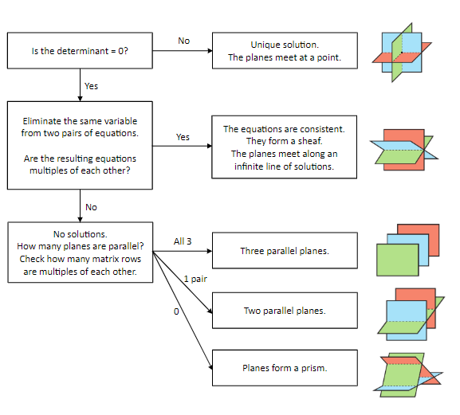

# Consistency

A system of 3D simultaneous equations can result in one of several outcomes

If the equations result in one or infinite solutions, the set of equations can be said to be 'Consistent', otherwise, it can be said to be 'not consistent'.