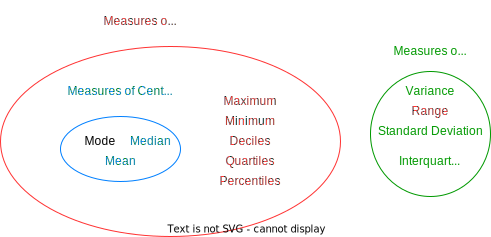

### Variables in algebra vs stats
##### Similarities
- Just like in algebra, variables in stats represent the value of some quantity, eg. shoe size, height, colour
- Variables can be [discrete or continuous](./../Collecting%20Data/Types%20of%20Data.md)
- Can be part of further calculations, eg. if $x$ represents a height, then $2x$ represents twice people's height. In stats this is known  as '[coding](./Coding.md)'

##### Differences
- Unlike algebra, a variable in stats represents the value of **multiple objects** (ie. it's a bit like a set).
- Because of this, we can do **operations** on it as if it were a **collection of values**:
    * if $x$ represents people's heights, $\sum x$ gives the sum of everyone's heights. In algebra this would be meaningless: if $x = 4$, then $\sum x$ makes no sense!
    * $\bar{x}$ is the mean of $x$. Notice $x$ is a collection of values, whereas $\bar{x}$ is a single value.
- To each value of the value of the variable, **we could attach an associated probability**. This is known as a [random variable](./../Collecting%20Data/Random%20Sampling.md).

### Measures

##### Measures of location
Single values which describe a position in a dataset.
Of these, measures of **central tendency** are to do with the **centre of the data**, ie. a notion of 'average'.  
##### Measures of spread
To do with **how data is spread out**