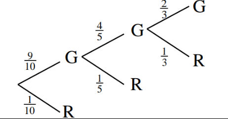

## Venn Diagrams

### Tree Diagrams
When drawing a tree diagram, it is important to remember where the labels go.
The probability of each branch being taken from its parent node should be labelled next to the branch. At each node/state, the value of that individual state should be labelled.
> Here is an example from the 2019 statistics paper mark scheme:
> 
>This is meant to model the following scenario:
>- There are three bags containing red and green beads
>- Bag A contains 9 green and 1 red
>- Bag B contains 4 green and 1 red
>- Bag C contains 2 green and 1 red
>- First, a bead is drawn from bag A, if it is red, no more beads are drawn. If not, a bead is drawn from bag B. If *that* bead is red, no more beads are drawn. If not, a final bead is drawn from bag C.
> 
> Note here that the final states at the end of the branches are not drawn (the state of the last choice is drawn instead). This is standard.