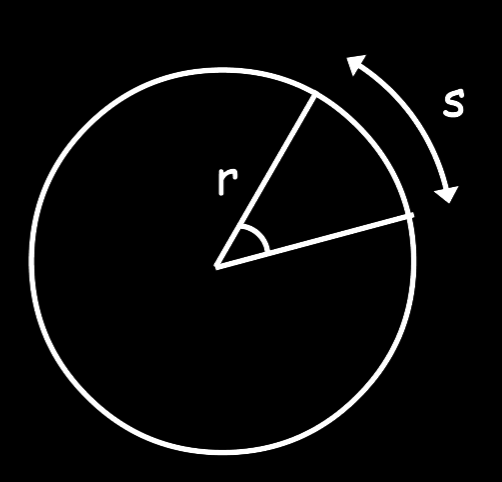
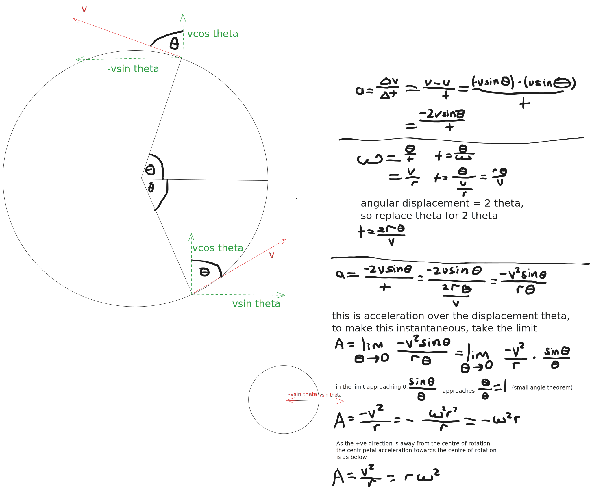

## Radians
One of the important things to know for circular motion is that all angles should be measured in radians. There are exactly $2\pi$ rad in one full turn ($2\pi$ rad = $360^\circ$).

It is important to note that the radian value of an angle can be determined by dividing the arc length of the relevant segment by the radius of the arc that is formed. This results in the following equation:

$$\frac{s}{r} = \theta$$

## Equations

### Centripetal Acceleration
$a = \frac{v^2}{r}$  
$a = r\omega^2$  

### Centripetal Force
$\sum F = \frac{mv^2}{r}$   
$\sum F = \frac{2E_k}{r}$  
$\sum F = mr\omega^2$

### Angular Speed
$\omega = \frac{\Delta\theta}{\Delta t}$  
$\omega = \frac{v}{r}$  
$\omega = \frac{2\pi}{T}$   
$\omega = 2\pi f$

For A whole circle, $v = \frac{2\pi r}{T}$, however, $T = \frac{2\pi}{\omega}$, so $v = \frac{r}{\omega}$

> $a$ ($\text{rad}\space\text{s}^{-2}$)= centripetal acceleration  
> $E_k$ ($\text{J}$) = kinetic energy  
> $f$ ($\text{H}_\text{z}$) = frequency  
> $\sum F$ ($\text{N}$) = resultant force
> $m$ ($\text{Kg}$) = mass  
> $r$ ($\text{m}$) = radius  
> $\Delta t$ ($\text{s}$) = time taken  
> $T$ ($\text{s}$) = time period for one full rotation    
> $v$ ($\text{m}\space{s}^{-1}$) = linear speed (instantaneous speed)  
> $\omega$ ($\text{rad}\space\text{s}^{-1}$) = angular speed  
> $\Delta\theta$ ($\text{rad}$) = change in angular displacement / change in angle of rotation

## Deriving Centripetal Acceleration
This is a question that may come up in an exam. It relies on only simple maths to do.

