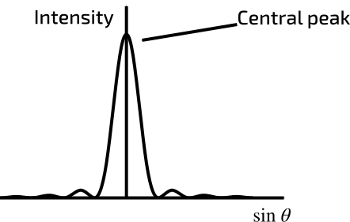
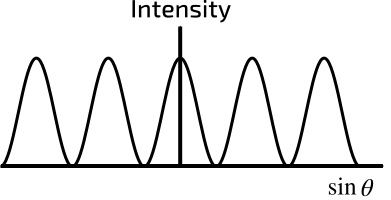
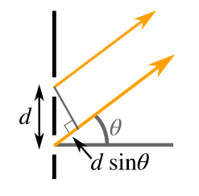

Diffraction is where a wave bends around a gap it is moving through. This only happens at the edges of the slit, and only happens at appreciable quantities when the slit size is of the same order of magnitude as the wavelength. 

## A Weird Fact
It can be said that in a wave, each wavefront is a line of point sources of the same wave, creating the wavefronts that proceed it. 

## A Small Slit
If the slit that the wave is passing through is of a significantly smaller size than the wavelength, then the slit acts as a point source of the wave. The closer to the wavelength is to the size of the slit, then the more of the wave that passes through the slit, and thus, the greater the amplitude of the waves that emerge out the other side of the slit.

## A larger slit
If the slit is larger than the wavelength, then the slit can be thought of as a line of point sources at the same level as the slit. Though, when emitted, the waves all have a phase difference of zero, as they are emitted from different places, this causes a path difference to develop. 

As a result of this, there is an observable interference pattern that is developed in the exiting waves. The resulting interference can be shown to follow the following graph.

## Two slits
If a coherent source of light is shone through two slits, near by, a specific pattern of bright spots can be observed on the target surface. It is defined by the equation $\sin^2\theta$ 

In this situation, there is an equation which applies:
$d\sin\theta = n\lambda$, where $d$ is the slit separation, $\theta$ is the angle to the target point, from the normal to the slits, $n$ is the order of the bright spots that appear on the target, with $n \ge 0$. $\lambda$ is the wavelength of the waves passing through the slits. 

Note that $d\sin\theta$ is equal to the path difference between the two parallel rays of light in this example. 

A using this equation and the small angle approximation, it is possible to find that $\lambda = \frac{xd}{L}$, where $x$ is the fringe separation between the bright spots, and $L$ the distance of the slits to the target. It is also useful to note that this should only be applied to the order zero bright spot, as applying to other bright spots prevents the small angle approximation from being used.

## Diffraction gratings
A diffraction grating is a plate, with many parallel slits cut into it. Generally, these slits are of a size such that commonly visible electromagnetic waves are diffracted  by the grating.

## The diffraction grating equation
- $\sin\theta = \frac{n\lambda}{d}$

This is the equation relating to diffraction gratings. In this equation, $n$ is the order of the maximum on the target, $\theta$ the angle from the grating to the target, $d$ the distance from the grating to the target and $\lambda$ the wavelength of the wave.

This equation is quite simmilar to the one for the double-slit case. This is because the path difference between ajacent slits is exactly the same as in the double-slit experiment.

## A general equation
- $\sin(\arctan(\frac{D_n}{d})) = \frac{n\lambda}{d}$

This equation is based on the above equation, except $\theta$ has been swapped out for a method to find it. The new term, $D_n$ that has been added is the distance of the order $n$ maximum from the order zero maximum.