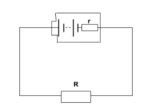

## The Basics
Current (I) - The flow of charge per unit time, also known as the rate of flow of charge
- $I = \frac{\Delta Q}{\Delta t}$
- Measured in Amperes (A)

Potential Difference (V) - The energy transferred per unit charge, between two points in a circuit.
- $V = \frac{E}{Q}$
- Measured in Volts (V)

Resistance (R) - A measure of how '*difficult*' for charge carriers / current to pass through some section of circuit. Equal to the potential difference over that section divided by the current in the section. 
- $R = \frac{V}{I}$
- Measured in Ohms ($\Omega$)

## I/V Characteristsics
**Ohm's Law** ($V = IR$) states that for an *ohmic conductor*, *current* is directly proportional to the *voltage* across it, as long as physical conditions are kept the same.

Below are some I/V graphs of common conductors that are needed at A-Level

### Ohmic Conductor
This type of component follows **Ohm's Law**, and so it's graph is a straight line through the origin.

### Diode (Semiconductor)
As a diode only allows current to flow in one direction, it makes sense that little to no current passes until the required threshold voltage is met.

### Filament Lamp
Surprisingly, until a threshold current, this type of conductor obeys **Ohm's Law**, however, as the current increases, and the metal filament heats up, the resistance increases, and thus causes a break from **Ohm's Law**

### Ammeter
Unless stated otherwise in a question, ammeters are assumed to have a resistance of *zero*, meaning their presence cannot affect the value they show. This does not actually apply in the real world though, as nothing is perfect.

### Voltmeter
Unless stated otherwise in a question, voltmeters are assumed to have infinite resistance, and as such, no current can flow through them. This is required to ensure that their reading is completely accurate. This does not actually apply in the real world though, as no part is perfect.

## Resistivity
**Resistivity** (Ohm-Meters / $\Omega M$) is a measure of how easily a material conducts electricity, and is therefore a property of the material in question. It is equal to the product of resistance and cross-sectional area of a piece of the material, divided by the length of the material.
$$\rho = \frac{R A}{L}$$
Note that resistivity is highly dependent on temperature, and the conditions of the material when it is being measured.

### Temperature in relation to resistivity
As the temperature of a conductor increases, the resistance of that conductor will as well. This is because the atoms of the conductor gain kinetic energy, and thus move more, blocking and slowing down electrons flowing through them in the process.

However, this does not seem to apply to all conductors. The biggest place where this does not apply is in a *thermistor*. In fact, in a *thermistor*, the **opposite** happens. As heat increases, the resistance drops instead. In fact, what is happening here, is that in a *thermistor*, as the temperature rises, electrons are **emitted** from the material of the *thermistor*, cancelling out the effect of the resistance increasing due to temperature.

### Superconductors
A **superconductor** is a material which, below a given temperature, known as the *critical temperature*, have **zero resistivity**. This temperature depends on the material the superconductor is made from, but most superconductors have very low critical temperatures, usually not far from absolute zero (-273 $^\circ C$).

## Series and Parallel
### Resistance
In series, resistance adds, so: $R_T = R_1 + R_2 + R_3 + \dots + R_n$

In parallel however, the reciprocal of total resistance is equal to the sum of the reciprocals of the resistance of the branches. 

$\frac{1}{R_T} = \frac{1}{R_1} + \frac{1}{R_2} + \frac{1}{R_3} + \dots + \frac{1}{R_n}$

### Current
In a series circuit, current is the same all across the circuit.

In a parallel circuit, the sum of the currents in each parallel set of branches is equal to the total current.

### Potential Difference
In a series circuit, the supply voltage is equal to the sum of the voltages across each component.

In a parallel circuit, the potential difference across each branch is the same.

It is important to note that when connecting identical cells in parallel, that the voltages do not add, whereas they do if joined in series.

## Power
**Electrical power** has several ways of being calculated:

$P = IV$ , $P = \frac{V^2}{R}$ and $P = I^2R$

As **power** is also equal to energy transferred over time, this can be used to find the energy transferred by a circuit in a given time.

## Kirchhoff's Laws
1. The total current flowing into a junction is equal to the current flowing out of that junction
	- This just means that no charge is lost at any point in the circuit
2. The sum of all voltages in a series circuit is equal to the supply voltage
	- This, combined with the previous law, shows that no energy is lost at any point within a circuit.

## Potential Dividers
A **potential divider** is a circuit with several resistors in series connected across a source voltage. By connecting leads to only one of the resistors, a lower voltage can be obtained, based on the resistances of the two resistors. It is not uncommon to see a thermistor, LDR or potentiometer placed as one of the resistors to allow for a variable voltage to be output. This is useful for automation events, like turning on a light or heater.

## Electromotive Force and Internal Resistance
### Internal Resistance
Batteries, and all power supplies have an **internal resistance**, caused by electrons colliding with the atoms in the power supply. This causes a small loss of energy before the electricity even exits the battery. This internal resistance is commonly shown as a resistor next to the batteries, encased in a box to indicate it is internal to the component.

### Electromotive Force
**Electromotive Force** (emf / $\epsilon$) is the energy transferred by a cell, per unit of charge that passes through it ($\epsilon = \frac{E}{Q}$). **Electromotive Force** is thus, measured in Volts, and so, **Ohm's Law** can be applied to it. This can be measured by measuring the voltage across the power supply when there is no current being drawn. This requires that the battery is in an open circuit, or is disconnected from the circuit.

### Equations
(These are based on the image above)

$R_{total} = R + r$  
$V = IR$  
$\epsilon = I(R_{total})$  
$\epsilon = I(R + r)$  
$\epsilon = IR + Ir$  

### Lost Volts
**Lost Volts** are equal to the current in the circuit times the internal resistance of the power supply. This is in effect, a lowering of the actual outputted voltage of the power supply. Therefore, it can be said that EMF is the sum of the **supply voltage** and the **lost volts** ($\epsilon = V + v$).

## Capacitors
Capacitors are electrical devices used to store electrical energy in a circuit, for later release.
Capacitors can be made in several ways, but all are roughly done by placing two charged plates next to each other. One is positively charged, and the other is negativly charged. The capacitance effect can be increased by placing a dielectric (insulator) between the plates.

Capacitance = Charge Displaced / Voltage Across Plate
$$C =\frac{Q}{V}$$

The factors affecting capacitance of a capacitor are as follows:
- Plate Area - Greater plate area gives greater capacitance
- Plate Spacing - Closer plate spacing gives greater capacitance
- Dieletric Material - Greater Permitivity of the material leads to greater capacitance

### Energy stored in a capacitor
The energy stored in the capcitor is equal to the area under the graph:

Thus, $E = \frac{1}{2}QV$ or $E = \frac{1}{2}CV^2$ or $E = \frac{1}{2}\frac{Q^2}{C}$

### Discharging a capacitor