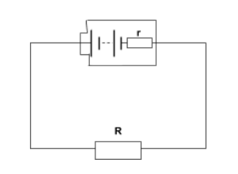

### Internal Resistance
Batteries, and all power supplies have an **internal resistance**, caused by electrons colliding with the atoms in the power supply. This causes a small loss of energy before the electricity even exits the battery. This internal resistance is commonly shown as a resistor next to the batteries, encased in a box to indicate it is internal to the component.

### Electromotive Force
**Electromotive Force** (emf / $\epsilon$) is the energy transferred by a cell, per unit of charge that passes through it ($\epsilon = \frac{E}{Q}$). **Electromotive Force** is thus, measured in Volts, and so, **Ohm's Law** can be applied to it. This can be measured by measuring the voltage across the power supply when there is no current being drawn. This requires that the battery is in an open circuit, or is disconnected from the circuit.

### Equations
(These are based on the image above)

$R_{total} = R + r$  
$V = IR$  
$\epsilon = I(R_{total})$  
$\epsilon = I(R + r)$  
$\epsilon = IR + Ir$  

### Lost Volts
**Lost Volts** are equal to the current in the circuit times the internal resistance of the power supply. This is in effect, a lowering of the actual outputted voltage of the power supply. Therefore, it can be said that EMF is the sum of the **supply voltage** and the **lost volts** ($\epsilon = V + v$).

