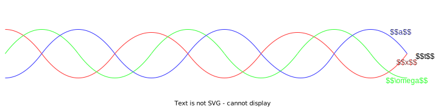

## Simple Harmonic Motion
SHM (Simple Harmonic Motion) is a regular oscillation where the acceleration of an object is proportional to the displacement from the equilibrium, and directed towards the equilibrium.

### Equations

$x = A\cos(\omega T)$

$v = A\omega\sin(\omega T)$

$a = -A\omega^2\cos(\omega T)$

$F = -kx$

$a = -\omega^2x$

$T = \frac{1}{f} = \frac{2\pi}{\omega}$

$\omega = 2\pi f$

## Damped Harmonic Motion