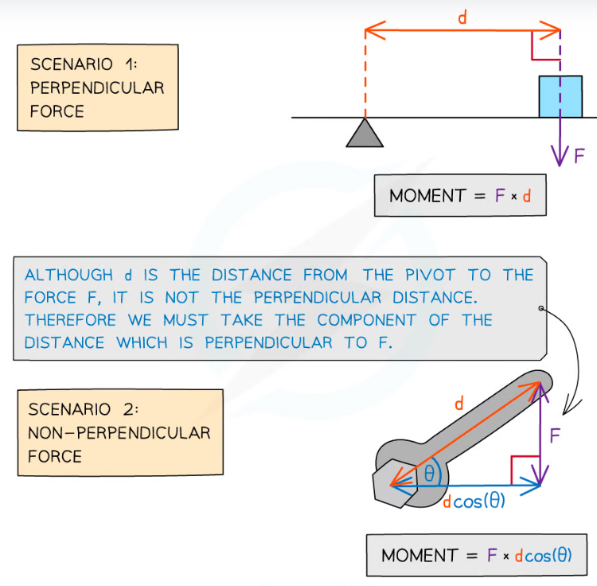

The moment of a force is the *turning effect of a force* around a pivot. The moment of a force can be calculated by the following formula, and is measured in Newton-Metres (Nm):

$$M_{oment} = F_{orce}\cdot d_{istance}$$

***Note:*** The distance term in the equation is the perpendicular distance between the pivot and force.

## The principle of moments
The principle of moments is that, when an object is at rest, then the sum of clockwise moments equals the sum of counter clockwise moments.

## Centre of mass
When calculating moments, it is important to calculate the moment from the centre of mass, rather than any arbitrary point. This can be found in several ways:

1. If the object is 'uniform' i.e. made of one material then the centre of mass is the average of all points in the object. (This is just the geometric centre)

2. If the object is 'non-uniform' i.e.. not made of one material, but is made of several parts of a uniform material with known centre of mass, then the centre of mass of the whole system is a weighted average of the centres of mass.

3. If the object is 'non-uniform' i.e. not made of one material, and is not made of several parts, or is not made of parts with known centres of mass, then just give up. It is not fun, and can't be calculated with A-Level knowledge. This shouldn't be asked about at A-Level