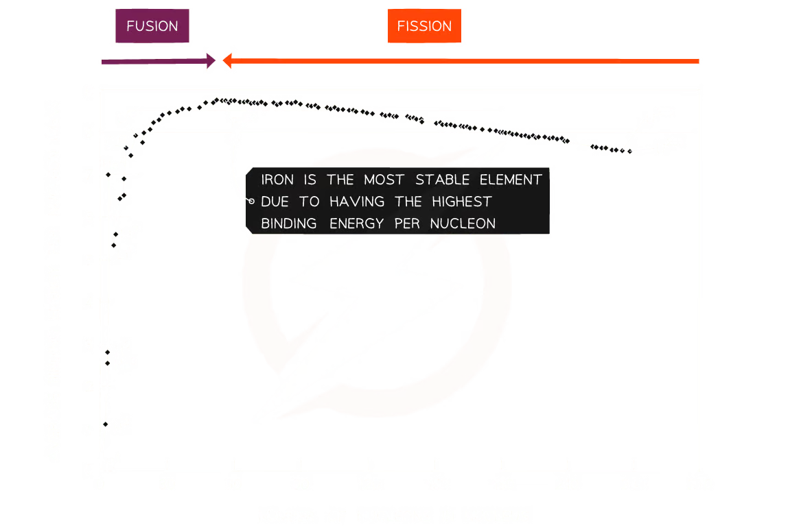

The mass of an atom can be calculated by firing ions through the magnetic / electric field within a mass spectrometer. Depending on the mass, a different amount of deflection can be observed.
### Atomic Mass Unit $u$
The atomic mass unit $u$ is defined as one twelfth the mass of an atom of Carbon 12.
$$u = \frac{m_{c12}}{12} = 1.660539\times 10^{-27}\text{Kg}$$
Using $E=mc^2$, $u = 931.5\text{MeV}$
### Masses of atomic particles
| Particle | Mass / $u$  | Mass / $\text{Kg}$       |
| -------- | ----------- | ------------------------ |
| Proton   | $1.007276u$ | $1.67262\times 10^{-27}$ |
| Neutron  | $1.008665u$ | $1.67493\times10^{-27}$  |
| Electron | $0.000549u$ | $0.00091\times10^{-27}$  |
So based on that, we can calculate the expected mass of atoms:
>Helium: 2 protons, 2 neutrons & 2 electrons
>$m_{He} = (2\cdot1.007276) + (2\cdot1.008665) + (2\cdot0.000549) = 4.032980u$
### Mass Defects
Often, the mass we can measure for a given atom is not actually what we would calculate its mass to be. For example, the calculated mass of helium is $4.032980u$, but its actual mass is $4.00260u$.
This difference is called a **Mass Defect**, and the defect for helium shows that it is too light.
More specifically, a mass defect is defined as the difference between the measured mass of a nucleus and the sum total of the masses of its constituents.
### Binding Energy
Why do mass defects exist? This is because to keep the nucleons together takes some amount of energy. This energy is actually taken from the mass of the atom ($E=mc^2$), and thus, the mass of a Helium atom can be less than the mass of the two protons and two neutrons that make it up on their own. The mass defect, when expressed as an energy, is called the binding energy.
> *Binding energy* is defined as:
> The work done in binding the nucleons of an atom together.

The formation of a nucleus from a system of isolated nucleons (nuclear fusion) thus must release energy, making it an *exothermic* reaction. 
In some questions, it may be necessary to convert between $u$ and $MeV$. To do this, multiply the value in $u$ by 931.5 to get the value in $MeV$
### Extension to all nuclei
As all nuclei are built from nucleons, we can calculate the total mass of all the constituents, and compare it to the mass of the resulting atoms. In every single case, the nucleus will be lighter than its constituents, and the bigger the atom, the larger the binding energy,
### Binding Energy per Nucleon
When comparing the stability of different nuclei, it is useful to use the *binding energy per nucleon.* This is sometimes notated as $A$.
$$\text{Binding energy per nucleon} = \frac{\text{Binding energy of nucleus}}{\text{Number of nucleons in nucleus}}$$
A higher binding energy per nucleon indicates a higher stability, as it requires more energy to pull the nucleus apart. Iron ($^{56}_{26}Fe$) has the highest binding energy per nucleon, which makes it the most stable of all elements.

In the above graph, we can see that atoms heavier than iron will release energy why undergoing fission, and atoms lighter than iron will release energy when undergoing fusion.
> Strangely, $^4_2\text{He}$, $^{12}_{6}\text{C}$  $^{16}_{8}\text{O}$ do not fit the trend: they are especially stable. The latter two because they can be considered to be multiple helium nuclei fused together.  