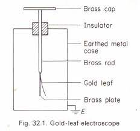
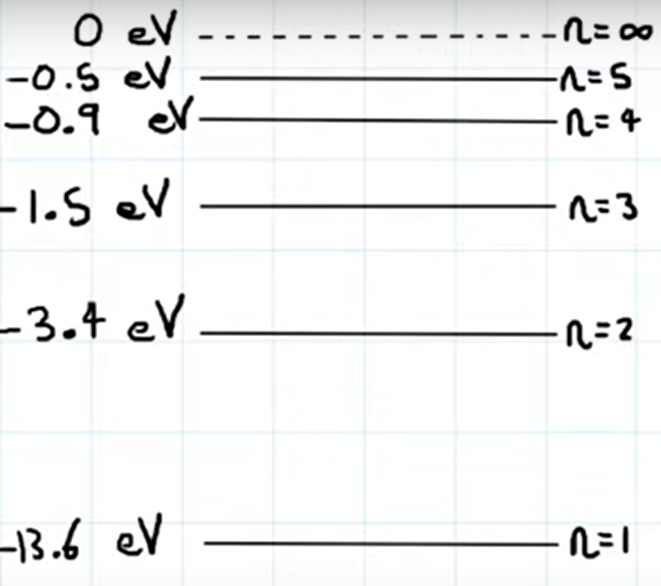
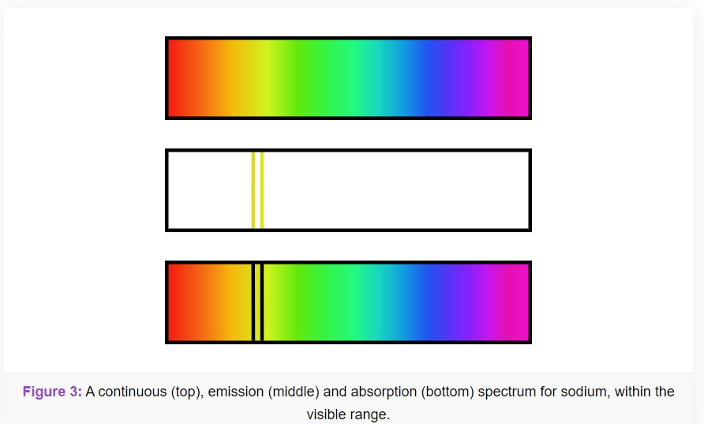

## The Equations
$E = hf$ (Energy = Planck Constant * frequency)  
$E = \phi + E_{kmax}$ (Energy = Work Function + Maximum kinetic energy)  
$hf = \phi + E_{kmax}$ (Planck Constant * frequency = Work Function + Maximum kinetic energy)  
$\lambda_{dB} = \frac{h}{\rho}$ (De Broglie Wavelength = Planck Constant / Momentum)

## Wave-Particle Duality
It can be shown that light-waves can behave as particles, and particles can exhibit the properties of waves. 

In particular, light interacts with matter in a manner more akin to a particle than a wave. Instead of transferring energy gradually 

## The Photoelectric effect
The photoelectric effect is the phenomenon that when light is shined on to a metal surface, electrons are ejected from the metal. This provides important evidence that light is '*quantised*', or carried in discrete packets.

### The laws of the photoelectric effect
1. Electrons are only emitted if  the *frequency* of the light is above a certain threshold frequency
2. If the frequency is high enough, the *intensity* of the light governs how many electrons are emitted.
3. The *maximum kinetic energy* of emitted electrons is independent of the intensity of the light, rather it is proportional to the frequency of the light.

### Experimental proof of the photoelectric effect
If the cap of a gold leaf electroscope is connected to a Van de-Graff generator, the whole rod and leaf become negatively charged, thus the gold leaf and brass plate repel each other.
If light of a specific frequency is shined onto the cap, electrons are released from the apparatus. This makes the whole thing less charged, and the gold leaf is repelled less from the plate. If the frequency of the light is reduced, a threshold frequency below which there is no effect can be observed.  
If the metal of the cap is changed, then the threshold frequency is changed, with more reactive metals having a lower threshold frequency.  

## Electron Energy levels
When an electron gains energy, it may become 'excited'. In an excited state, it will climb to a higher energy level. If It has enough energy to climb past the top energy level, the electron will become free of the atom it was a part of, keeping the energy it has left over as kinetic energy (This is called ionisation). If it is not in possession of enough energy and if it has enough energy to precisely climb to a higher energy level, it will. Otherwise, the electron will not gain any energy. After some time, the electron will climb back down the energy levels. In doing this, it may skip over any number of energy levels bar the lowest (known as the 'ground state'). When it does fall to a lower energy level, a photon will be released with the same energy as the electron lost while falling through the energy levels.

### The ways to gain energy:
- From a photon  
	When energy is gained from a photon, 100% of the energy from the photon is absorbed. If the photon does not have precisely enough energy to raise the electron up to a higher energy level, it will **not** interact with the electron in the first place. 

- From a particle collision.  
	This can occur as a result of a collision with any of several types of particle (electrons, protons, neutrons, ions, muons), so long as the atom is being bombarded with it. Most commonly examined are electrons, as they can be accelerated in a CRT.

	When a particle is absorbed, **some** or **all** of the energy can be absorbed. The quantity of energy absorbed is equal to the quantity of energy required for the electron to be promoted to the next electron energy level. As such, if a particle has just more than needed, only the amount needed will be taken. This does not apply if the particle has enough energy to release the electron from the atom. In this case, the electron will take all the energy, and be released from the atom.

### An example energy level diagram
(This one is for hydrogen)  
  
To climb from the energy level marked $n = 1$ to the one marked $n = 2$ requires $(-13.6)-(-3.4) = 10.2$ eV

## Spectra

### Continuous
A continuous spectra is one without any gaps, missing none of the wavelength of light between it's start and end. This type of spectra is most commonly produced in the cores of stars, or from any **hot, dense** source

### Emission
When an electron transitions from a higher energy level to a lower one, a photon is emitted with the kinetic energy equal to that lost by the electron. This results in specific, discrete wavelengths of light being produced. This then is represented with sparse coloured lines on a black background. Emission spectra are almost always produced by **hot, low pressure gas**.

### Absorption
This type of spectrum is made when white light is shined through **cool, low-pressure gas**. The photons in the white light of the correct energy levels to be absorbed by the gas are not able to make it through, and thus result in black bars in the spectrum of light.

It is important to note that the electrons here will eventually de-excite. This results in light emmitted in all directions, rather than just in the direction of the white light's travel. Thus, dimmer areas will appear on the output spectrum.

## De Broglie Wavelength
The "de Broglie wavelength" of a particle indicates the scale at which said particle will exhibit wave-like properties. This length, often notated as $\lambda_{dB}$ or more simply as just $\lambda$ allows for the calculation of the scales on which wave-effects such as diffraction should be expected for a given particle. It is important to be able to use the equation for de Broglie wavelength in an exam, and to rearrange it and combine it with the equation for kinetic energy. This results in the following equation:

$$\lambda_{dB} = \frac{h}{\sqrt{2mE_k}}$$

Where:
- $\lambda_{dB}$ is the de Broglie wavelength of the particle
- $h$ is Planck's Constant
- $E_k$ is the kinetic energy of the particle
- $m$ is the mass of the particle