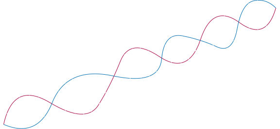
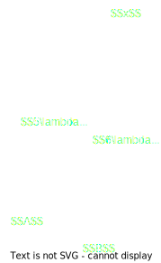
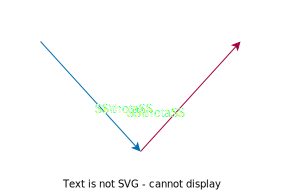
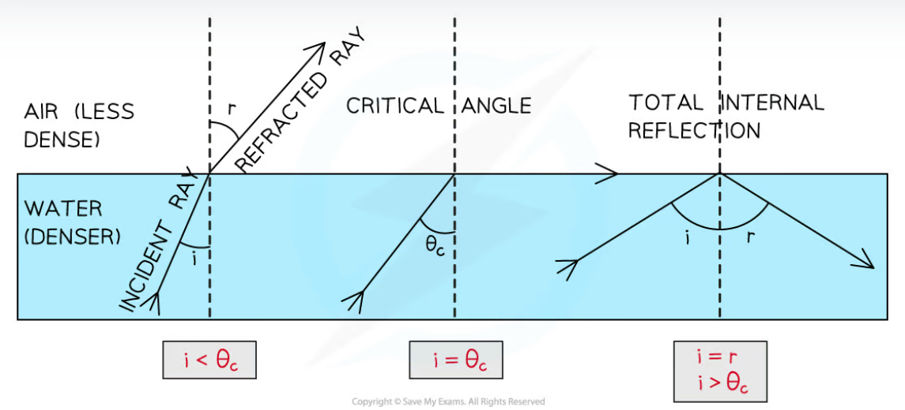
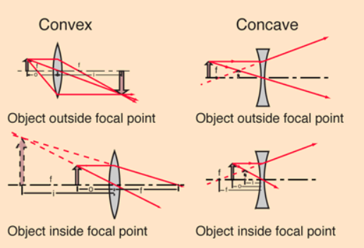

## Types of waves
### <u>Transverse</u>
A wave where the direction of oscillation is in the direction perpendicular to that of the propagation/energy transfer

### <u>Longitudinal</u>
A wave where the direction of oscillation is in the direction parallel to that of the propagation /  energy transfer. 

Longitudinal waves often consist of waves of high and low pressure. The high pressure is at the crests of the wave, and low pressure at the troughs. These areas of high and low pressure are said to have undergone compression and rarefaction respectively.

## Wave Properties
### <u>Amplitude</u>
The distance between the crest / trough of a wave and the point of rest.

or 

The magnitude of the displacement between the crest / trough and the point of rest

### <u>Frequency</u>
The number of waves that pass a point per unit time.

 = 1/Time Period 

### <u>Time Period</u>
The time taken for a full wave to pass

 = 1/Frequency

### <u>Wave Speed</u>
The distance travelled by the wave per unit time

### <u>Wavelength</u>
The distance between two equivalent positions on a wave. Just because the displacement is the same, that does not mean the position on the wave is equivalent

### <u>Wavefront</u>
The point in a wave that is 

## Polarisation
A transverse wave oscillates a right angles to the direction of propagation. This means that the direction of oscillation can be any angle in the resulting plane. Both of the waves shown below are of the same phase, but are polarised 90 degrees away from each other.

One major thing to note, is that this only occurs for transverse waves. As the direction of oscillation is parallel to the direction of motion in a longitudinal wave, it cannot be polarised.

### A Simple Experiment
Using two polaroid filters, rotate one 90 degrees with respect to the other. Notice how this prevents any light from passing through the two together.

Though this isn't needed for A-Level, the graph of the intensity of the light through the two filters as you rotate them is actually $I = \cos^2A$

### Light Sources
It is important to note that most light is 'unpolarised'. This includes sunlight, and almost all light made by bulbs, filament, LED or halogen. Unpolarised light is not actually special, in fact the word 'unpolarised' just means that the light is made of a mixture of all polarisations.

## Coherence
For two waves to be coherent, they must have the same speed, wavelength and frequency. They **do not** need to be in phase though. Coherent light is that which fulfils all of these requirements. The most common way to produce this kind of light is by use of a laser. Such lasers always produce only coherent light.

## Intensity
$$I = \frac{P}{A}$$
Where $I$ is intensity in $WM^{-2}$, $P$ is power and $A$ is the area the light covers.
There is a special case of this for a point light source, shining in all direction: $$I = \frac{P}{4\pi r^2}$$

## Superposition, Path difference and Phase Difference
### The principle of superposition
If two or more waves mee, then the result is the vector sum of the displacements. In effect, this means that there is constructive interference (so an increased amplitude) if the waves are in phase, and destructive interference (a reduced amplitude) if the wave are in antiphase.

### Path Difference

$||\underline{Ax}| - |\underline{Bx}|| = P_{athDifference}$

### Phase Difference
$\frac{P_{athDifference}}{\lambda} \mod 1 = P_{haseDifference}$

The above equation results in a value between 0 and 1. This can be multiplied by $360^\circ$ or $2\pi$ to get the value in radians or degrees.

## Reflection, Refraction and TIR

### Reflection
Reflection happens when a wave hits a surface. This can even include changes within the same material. It is important to note that the angle of reflection is always the same as the angle of incidence, except mirrored around the normal to the surface.

### Refraction
Refraction is what happens when a wave passes through a surface and into the material. Refraction is caused by the changing of the wave speed it enters the material, as each different material has a different 'maxmimum wave speed', (eg. speed of light, $c$). If the wave is speeding up by going into the material, the angle of refraction will bend away from the normal to the surface, conversely, if the wave is slowing down. it will bend towards the normal. This is often quoted in terms of refractive indeces, where moving into a higher refactive index material will result in a bend away from the normal.

### Total Internal Reflection
When a wave hits a surface, some of it may be reflected, and some may be refracted. However, there is a situation, when refraction results in effective reflection. This is in the situation of total internal reflection. This happens when a wave is exiting a material with an angle of incidence greater than the limiting angle, the '*Critical Angle*' and is exiting into a less dense material. Beyond this angle, the wave is reflected in entirety back from the boundary surface into the material from which it was incident. 

Total internal reflection is commonly used in fibre-optic cable, allowing the light inside to travel for long distances with minimal attenuation.

## Lenses
### Lens Diagrams

A lens diagram is used to graphically find the image of an object through a lens, given the lens' position, focal points and the object's position relative to the lens. It is important to note that when drawing such lens diagrams, a convex lens is represented as a line with arrowheads at each end, and a concave lens as a straight line with upside-down arrowheads at the tips.

### Images
When using a lens, there are two types of image that can be produced: real and virtual. A real image is formed when the light rays reaching your eyes have bounced off the object, and passed through the lens. This type of image is called real because it accuratly relflects the real-world position and scale of the objects depicted within. A virtual image is called what it is because it *does not* accurately represent these things. This results in the image appearing to be on the same side of the lens as the object itself.

#### Using Lenses
There are four main situations that need to be known, as shown below:

| Object Position | Convex | Concave |
| :---: | :---: | :---: |
| Before Focal Length | Enlarged Virtual Image | |
| At Focal Length | Virtual Image At Infinity (No Image) | |
| After Focal Length | Enlarged Inverted Real Image | | 
| At 2x Focal Length | Inverted Real Image (No Magnification) | |
| Beyond Focal Length | Inverted Diminished Real Image at Focal Length | | 

***Finish This Table***

### Lens Equations
The following equations apply to 'thin' lenses. Such lens is assumed to only bend the light once, unlike real lenses.

#### Lens Focal Length
$\frac{1}{I_{dist}} + \frac{1}{O_{dist}} = \frac{1}{f}$ 

$\frac{1}{I_{height}} + \frac{1}{O_{height}} = \frac{1}{f}$
> - $I_{dist}$ - Image distance from lens
> - $O_{dist}$ - Object distance from lens
> - $I_{height}$ - Image height
> - $O_{height}$ - Object height
> - $f$ - focal length

**Note:** The values are only positive if the image formed is real.

#### Lens Power and Magnification
$m = \frac{I_{height}}{O_{height}}$
> - $I_{height}$ - Image height
> - $O_{height}$ - Object height
> - $m$ - Magnification

$P = \frac{1}{f}$
> - $P$ - Power
> - $f$ - Focal Length

$P = \frac{1}{O_{height}} + \frac{1}{I_{height}}$
> - $P$ - Power
> - $O_{height}$ - Object height
> - $I_{height}$ - Image height

